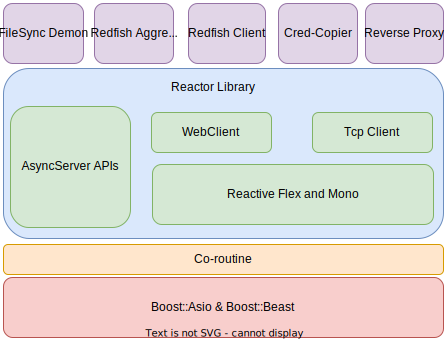

# BMC Apps

This is repository of useful applications in a distirbuted service enviroments. This application are proof of concept for the [Reactor](https://github.com/abhilashraju/reactor) library. 

The applications themselves are useful for various usecases we see in server management systems.

Following are the list of applications.
- [Agrregator](https://github.com/abhilashraju/bmcgw/tree/main/aggregator): A redfish aggregator that can scatter the redfish request from clients to multiple satelite BMCs. Aggregate the responses according to agrregator schema. 
- [FileSync](https://github.com/abhilashraju/bmcgw/tree/main/filesync): A Filesync service that can sync data between BMC using a mutually trusted encryption channel. 
- [CredCopier](https://github.com/abhilashraju/bmcgw/tree/main/credcopier): A Tcpclient that can make connection to remote FileSync server to transfer confidential data through a mutually trusted encrypted channel.
- [Reverse Proxy](https://github.com/abhilashraju/bmcgw/tree/main/reverseproxy): A reverse proxy implementation that act as an entry point for all redfish endpoint. Using a configuration file BMC can decide to whome the purticular request should be forwarded to. 
- [HttpServer:](https://github.com/abhilashraju/bmcgw/tree/main/httpserver) A Http Server implimentation that shows how easy it is to write a webserver using the reactor framework.
- [Heartbeat Server](https://github.com/abhilashraju/bmcgw/tree/main/heartbeatserver) An implementation of heartbeat server based on UDP server/client framework from the [Reactor](https://github.com/abhilashraju/reactor) toolkit.

Backbone of all these applications are the [Reactor](https://github.com/abhilashraju/reactor) library, which lifts some useful client/server abstractions out of boost::asio and boost::beast libraries. 

### Architeture

