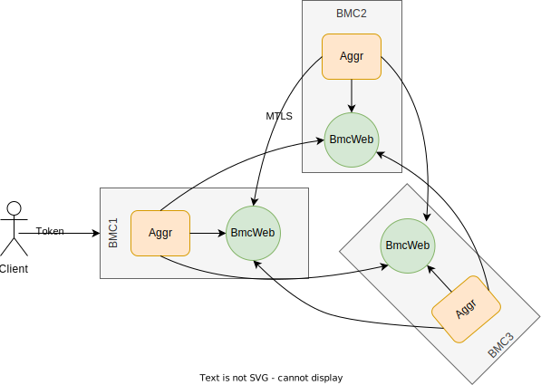

## Background
OpenBMC runs the bmcweb application to cater to the redfish way of managing the server. This bmcweb has an Aggregator [feature](https://github.com/openbmc/bmcweb/blob/master/AGGREGATION.md) which has the capability of pulling/forwarding the commands to the satellite BMCs. 

## Problem Description
To develop a system, with more than one satellite BMCs we would need an aggregator running in the primary BMC, concurrently interacting with all satellite BMCs with high performance. Current aggregator design has listed its limitations well - but it does not seem to be easily scalable -or- enhanceable implementation.

## Current Aggregator design limitations
1. Its tightly embedded within the bmcweb - redfish server.
2. Same application is performing both the https client & server jobs
3. Aggregation is a compile time option, not a runtime choice to support the BMC failure scenarios. Any BMC should be able to be a primary BMC on failure of current primary BMC.
4. Can work with single satellite BMC - not scalable
5. No secure channel between the aggregated BMCs
6. No authentication between the aggregated BMCs

## proposed design - phosphor-aggregator application
1. Pull out the aggregator to be an independent application from the bmcweb
2. Assign a dedicated port 
3. Redfish clients can talk to any BMC. The aggregator seemlessly gather information from other BMCs.
4. Enable mTLS & token based auth to talk to the satellite
5. This app will do only aggregation - by acting as a proxy between redfish clients and the local/satellite bmcweb applications - this makes it a very light weight app and less error prone. 
6. Adding a new feature in bmcweb will not have any impact on the aggregator app. 
7. By default all resources should be aggregated. It should be a switch at the feature to let the aggregator know if the data needs to be aggregated or not.
8. BMCWEB_ROUTE handler need not worry about any aggregation related logic.
9. Any addition or removal of the satellite BMC can be handled by a "registration" mechanism in this app

